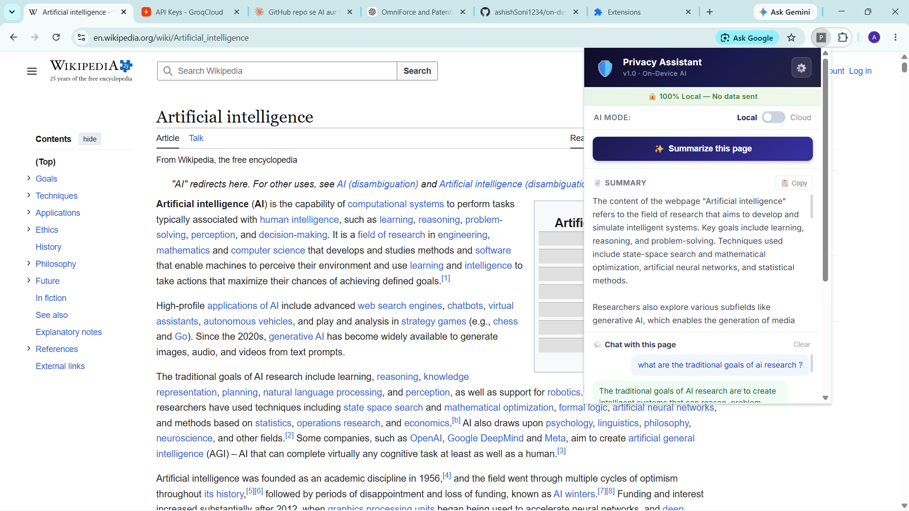
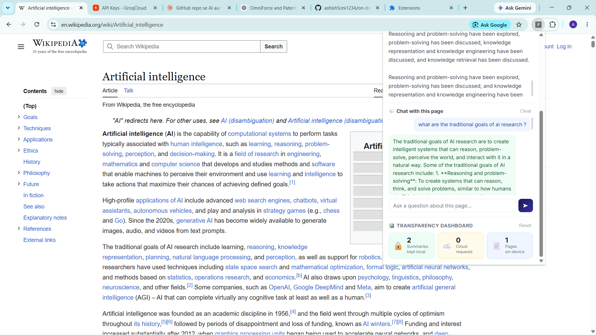

# 🛡️ Privacy Page Assistant

<div align="center">
  <p><strong>A 100% Local, On-Device AI Chrome Extension for Web Summarization and Privacy Policy Analysis.</strong></p>
  
  
  
  
</div>

---

## 💡 About the Project

**Privacy Page Assistant** is a privacy-first browser extension that brings the power of Large Language Models directly to your local device. In an era where every AI tool sends your personal reading data to the cloud, this extension runs AI inference **locally on your device's GPU** using WebAssembly and WebGPU. 

It guarantees zero data leakage—your browsing data, articles, and private information never leave your computer unless you explicitly choose to use the Cloud fallback mode.

This project was built to demonstrate advanced on-device AI engineering, managing WebGPU constraints, and implementing a privacy-centric user experience within the constraints of Chrome Manifest V3.

👉 **For a deep dive into the technical architecture, WebGPU constraints, and Graceful Fallback mechanisms, please read the [Technical Documentation](DOCUMENTATION.md).**

---

## 🛠️ Technology Stack

- **Core Framework:** Chrome Extension Manifest V3
- **Language:** TypeScript
- **Build Tool:** Vite + CRXJS
- **Local AI Engine:** WebLLM (`@mlc-ai/web-llm`) running SmolLM2-360M-Instruct
- **Cloud AI Fallback:** Google Gemini API (gemini-1.5-flash) & Groq API (llama-3.3-70b) — *(Planned support for OpenAI, Anthropic, and other frontier models)*
- **Content Parsing:** Mozilla's Readability.js
- **Styling:** Vanilla CSS (Modern, lightweight, no-framework approach)

---

## ✨ Current Features

This extension currently implements **7 core features**:

1. **✅ Page Summarization**  
   Extracts the main content of any article or webpage and generates a concise, accurate summary using AI.
2. **✅ Privacy Indicator**  
   A clear, visual badge that verifies data safety in real-time (`🔒 100% Local — No data sent`).
3. **✅ Local ↔ Cloud Toggle**  
   Seamlessly switch between maximum privacy (Local SmolLM2 360M) and maximum speed/quality (Cloud). Currently supports Gemini and Groq, with planned integrations for OpenAI, Anthropic, and other frontier models.
4. **✅ Explain This Privacy Policy**  
   Context-aware detection that automatically offers to translate complex, jargon-heavy privacy policies into simple bullet points.
5. **✅ Chat with Page**  
   A built-in Q&A interface allowing users to ask specific questions about the article they are currently reading.
6. **✅ Model Loading Progress Bar**  
   Smooth UX for downloading and caching the ~380MB local WebLLM model into the browser's persistent storage.
7. **✅ Transparency Dashboard**  
   Analytics counters tracking how many summaries were kept entirely on-device versus how many used the cloud fallback.

---

## 🚀 Installation & Setup

### Prerequisites
- Google Chrome (version 113 or higher recommended for WebGPU support)
- Node.js (v18+)

### Steps to Run Locally
1. **Clone the repository**
   ```bash
   git clone https://github.com/yourusername/privacy-page-assistant.git
   cd privacy-page-assistant
   ```

2. **Install dependencies**
   ```bash
   npm install
   ```

3. **Build the extension**
   ```bash
   npm run build
   ```
   *This will generate a `dist/` folder containing the compiled extension.*

4. **Load into Chrome**
   - Open Chrome and navigate to `chrome://extensions/`
   - Enable **"Developer mode"** in the top right corner.
   - Click **"Load unpacked"** and select the `dist/` folder generated in the previous step.

5. **Test the Extension**
   - Pin the extension to your toolbar.
   - Navigate to any Wikipedia article or blog post and click the extension icon to start summarizing!

---

## 🗺️ Future Roadmap

The architecture is designed to be extensible. The following features are planned for future releases:

- **🔜 Gmail AI Reply:** Context-aware smart replies embedded directly into the Gmail UI, drafted entirely on-device to protect private email content.
- **🔜 Local Semantic Memory (RAG):** Creating a local vector index of read articles to allow users to ask questions across their entire browsing history without sending that history to a cloud provider.
- **🔜 Battery-Aware AI Mode:** Automatic detection of laptop battery status to dynamically switch between the heavy local GPU model and a lightweight cloud API to conserve power.
- **🔜 Hybrid Instant + Cloud Boost:** An architecture where the local model instantly provides a 2-second initial summary, while the cloud API asynchronously fetches a deeper, more comprehensive analysis.

---

## 🤝 Contributing
Contributions, issues, and feature requests are welcome! Feel free to check the issues page.

## 📝 License
This project is licensed under the MIT License - see the LICENSE file for details.

---

## 📸 Screenshots & Demo

Here is a look at the extension in action:




